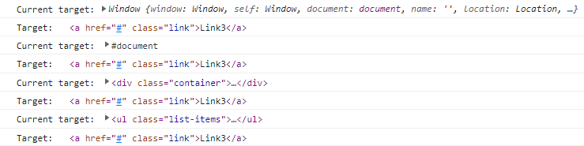

# Javascript Notes

- [Javascript Notes](#javascript-notes)
  - [Javascript Basics](#javascript-basics)
    - [Ways to add js](#ways-to-add-js)
    - [variable](#variable)
    - [functions](#functions)
    - [Objects](#objects)
    - [Array Methods](#array-methods)
    - [Value vs Reference](#value-vs-reference)
  - [DOM](#dom)
    - [window object](#window-object)
    - [Traverse child nodes](#traverse-child-nodes)
    - [Mouse Events](#mouse-events)
    - [Key Events](#key-events)
    - [Event Object](#event-object)
    - [Example of event bubbling](#example-of-event-bubbling)
    - [Forms events](#forms-events)
    - [Local Storage](#local-storage)
    - [setTimeout](#settimeout)
    - [setInterval](#setinterval)
    - [Global events](#global-events)
    - [Width and Height](#width-and-height)
    - [resize event](#resize-event)

## Javascript Basics

### Ways to add js

- **Inline**

```javascript
<button onclick="alert('Inline Js')">click me!</button>
```

- **Internal**

```javascript
<script>
document.querySelectorAll(".btn").forEach((element, index) => {
element.addEventListener("click", () => {
   alert("This is Button number "+index);
 });
});
</script>
```

- **External**

```htm
<script src="./main.js"></script>
```

### variable

1. Must start with letter ,$ or \_
2. No keyword
3. camelCase or underscore
4. case sensitive - fullName vs FullName

- **var**

1. var variables can be re-declared and updated

```javascript
var greeter = "Hello";
var greeter = "Hey";
```

```javascript
var greeting = "Hello";
greeting = "Hey";
```

- **let**

1. let is block scoped
2. A block is a chunk of code bounded by {}.
3. let can be updated but not re-declared.

```javascript
let greeting = "Hello";
greeting = "Hey";
```

```javascript
let greeting = "Hello";
let greeting = "Hey"; // error: Identifier 'greeting' has already been declared

// if the same variable is defined in different scopes, there will be no error
let greeting = "Hello";
if (true) {
  let greeting = "Hi";
  console.log(greeting); // "Hi"
}
console.log(greeting); // "Hello"
```

- **const**

1. const declarations are block scoped.
2. const cannot be updated or re-declared
3. we should always assign value while declaring const.

```javascript
const greeting = "Hello";
greeting = "Hey"; // error: Assignment to constant variable.
```

```javascript
const greeting = "Hello";
const greeting = "Hey"; // error: Assignment to constant variable.
```

```javascript
const greeting; // error: Missing initializer in constant declaration.
```

### functions

- **definition/declaration**

```javascript
function add(num1, num2) {
  return num1 + num2;
}
```

- **function expression**

```javascript
const addition = function add(num1, num2) {
  return num1 + num2;
};
```

```javascript
// anonymous function in javascript
const addition = function (num1, num2) {
  return num1 + num2;
};
//anonymous function as arrow function
const addition = (num1, num2) => {
  return num1 + num2;
};
```

### Objects

```javascript
const car = {
  make: "Dodge",
  model: "Challenger",
  year: 1970,
  colors: ["black", "red"],
  hybrid: false,
  drive: function () {
    console.log("driving...");
  },
  //ES6 syntax
  stop() {
    console.log("stopped!!!");
  },
};

console.log(car.make);
console.log(car.colors[0]);
car.drive();
car.stop();
```

### Array Methods

- **length**
- **unshift()** - instert items at index 0
- **shift()** - remove items from index 0
- **push()** - insert items at last index
- **pop()** - remove items from last index.
- **splice(startIndex , numberOfItems)** - give specific value from array but **mutates orignal array** avoid using it.

### Value vs Reference

- **Value**
  **Note** :- When assigning primitive data types(String,Number,Symbol,Boolean,Undefined,Null) to a variable any change are made directly to that value, without affecting original Value.

```javascript
let number = 1;
let number_2 = number;
console.log(`number: ${number} and number_2: ${number_2}`);
//number: 1 and number_2: 1
number_2 = 5;
console.log(`number: ${number} and number_2: ${number_2}`);
//number: 1 and number_2: 5
```

- **Reference**
  **Note** :- When assigning non-primitive data types(Arrays,Function,Objects) to a variable is done by reference so any change will affects all the reference

```javascript
let person = { name: "ashutosh" };
let person_2 = person;
console.log(`person name : ${person.name} and person_2 name: ${person_2.name}`);
//person name : ashutosh and person_2 name: ashutosh
person_2.name = "Ethan";
console.log(`person name : ${person.name} and person_2 name: ${person_2.name}`);
//person name : Ethan and person_2 name: Ethan

//ES6 Fix - we can use spread operator
let person_3 = { ...person }; // not pointing to person but we are copying.
person_3.name = "Ethan";
console.log(`person name : ${person.name} and person_3 name: ${person_3.name}`);
//person name : ashutosh and person_3 name: Ethan
```

## DOM

### window object

- **window object** :- also knowns as browser api.
- **document** - document is present inside window object alongside other object.

  - return node object or node list , which is an array like object
  - convert NodeList to array using
  - if you want to find out the methods and property present on node object use **console.dir(document)** , you can pass different node object.

```javascript
let res = document.querySelectorAll(".btn");
console.log(res);
console.log(typeof res);
//  nodeList.forEach() is now standard and supported in all current browsers
res.forEach((element) => {
  console.log(element);
});

// ES6 allow you to do it in two more ways
// let myArray = Array.from(NodeList);
//let myArray = [...NodeList] // deconstructing;
console.log([...res]);

Array.from(res).forEach((element) => {
  console.log(element);
});

let heading = document.getElementById("heading");
console.log(typeof heading);
console.log(heading);
console.log(heading.nodeName);
console.log(heading.style); // provide all css declaration property .
heading.style.backgroundColor = "red"; // set background as red for for heading.
```

- **document.getElementsByTagName("h1") and document.getElementsByClassName()**
  - return HTMLCollection array-like object , You can access by index and length property but we can't use array methods like forEach.

```javascript
let byTag = document.getElementsByTagName("h1");
console.log("tag", byTag);
// before using forEach convert it to Array using ES6 syntax
Array.from(byTag).forEach((element) => {
  console.log(element);
});
let arrayValue = [...byTag];
console.log("arrayvalue:", arrayValue);
arrayValue.forEach((element) => {
  console.log(element);
});
```

- **document.querySelectorAll(".btn")**
  - **document.querySelector(".btn")**- return first match single unit.( it's not a NodeList)
  - Most powerful and used mostly as we can use complex query selector .
  - return NodeList objects and we can directly run array methods.
  - You can turn them to array using spread operator [...] and Array.from()
  - but to iterate it's not required as latest browser supports direct forEach now.

### Traverse child nodes

- **childNodes and children**

```html
<ul class="fruits">
  <li>Apple</li>
  <li>Banana</li>
  <li>Orange</li>
  <li>Kiwi</li>
  <li>Mango</li>
</ul>
```

```javascript
const fruits = document.querySelector(".fruits");

const allChildNode = fruits.childNodes; // return (NodeList)all childNodes including whitespace which is treated as text node
console.log(allChildNode);
// NodeList(11) [text, li, text, li, text, li, text, li, text, li, text]
const allChildren = fruits.children; // return(HTMLCollection) and only children
console.log(allChildren);
//HTMLCollection(5) [li, li, li, li, li]
```

- **parent**

```html
<div id="main-heading">
  <h1>Main Heading</h1>
  <div class="sub-heading">
    <h2>Sub Heading</h2>
  </div>
</div>
```

```javascript
let subHeading = document.querySelector(".sub-heading");
console.log(subHeading);
subHeading.style.color = "green";
let parent = subHeading.parentElement;
console.log(parent);
parent.style.color = "red";
```

- **previousSibling and nextSibling**

  - return whitespace.
  - .nextSibling will return text node.
  - try to use .nextSibling.nextSibling to get the next sibling.
  - same goes for previousSibling.

- **previousElementSibling and nextElementSibling**

  - select next/ previous element sibling and exclude whitespace text node.
  - used most of the time.

- **nodeValue vs textContent**

```html
<div id="special">This is content value</div>
```

```javascript
let special = document.querySelector("#special");
console.log(special.childNodes);
console.log(special.childNodes[0].nodeValue);
// accessing directly nodeValue will return null so we must use
// childNodes[0] will be be text node
// we can use firstChild as well.
console.log(special.firstChild.nodeValue);
// textContent will directly return value.
console.log(special.textContent);
```

- **getAttribute() and setAttribute()**

```html
<div id="special">This is content value</div>
```

```javascript
const special = document.querySelector("#special");
console.log(special.getAttribute("id"));
special.setAttribute("class", "hello");
special.textContent = "this is updated content";
```

- **Add and remove class dynamically using classList vs style**
  - if we use style we need to write all properties one by one .
  - Best approach is write a css file with class name and add class using classList.

```html
<!DOCTYPE html>
<html lang="en">
  <head>
    <meta charset="UTF-8" />
    <meta http-equiv="X-UA-Compatible" content="IE=edge" />
    <meta name="viewport" content="width=device-width, initial-scale=1.0" />
    <title>Javascript Basics</title>
    <style>
      .changeColor {
        color: red;
      }
      .changeFontSize {
        font-size: 3rem;
      }
    </style>
  </head>
  <body>
    <h1 id="first">This is first element.</h1>
    <h1 id="second">This is second element.</h1>
    <h1 id="third">This is third element.</h1>
    <button id="btn">Click to toggle</button>
  </body>
  <script src="./main.js"></script>
</html>
```

```javascript
const first = document.querySelector("#first");
first.style.backgroundColor = "red";
first.style.color = "white";
first.style.fontSize = "3rem";
```

```javascript
const first = document.querySelector("#first");
const second = document.querySelector("#second");
const third = document.querySelector("#third");
const btn = document.querySelector("#btn");
first.className = "changeColor";
first.className = "changeFontSize"; // this will override the changeColor class
first.className = "changeColor changeFontSize"; // this will resolve the issue but not a best way to do things.

// classList
second.classList.add("changeColor");
second.classList.add("changeFontSize");
// This will not override changeColor class as it's adding in the list.
second.classList.remove("changeColor"); // This will only remove changeColor class

third.classList.add("changeFontSize");

btn.addEventListener("click", function (e) {
  console.log(e);
  console.log(this); // note if you use arrow function this will represent window and not button.
  third.classList.toggle("changeColor");
});

if (third.classList.contains("changeFontSize")) {
  console.log(`Third element contains changeFontSize class !!`);
} else {
  console.log(`Third element doesn't contain changeFontSize class`);
}
```

- **createElement/createTextNode/appendChild**
  - appendChild will always add the child in the end .

```html
<div class="container">
  <div class="main-heading">This is main heading</div>
</div>
```

```javascript
const container = document.querySelector(".container");
console.log(container.children); // HTMLCollection [div.main-heading]

// create div element with class sub-heading

let newDivElement = document.createElement("div");
// createTextNode
let textNode = document.createTextNode("This is sub heading");
// append text node to element
newDivElement.appendChild(textNode);
// now add sub-heading class to new element
newDivElement.classList.add("sub-heading");
// now append new element to container
container.appendChild(newDivElement);
console.log(container.children); // HTMLCollection(2) [div.main-heading, div.sub-heading]
```

- **insertBefore()**
  - insertBefore(element,location)

```javascript
const container = document.querySelector(".container");
const mainHeadingElement = document.querySelector(".main-heading");
console.log(container.children); // HTMLCollection [div.main-heading]
// create div element with class sub-heading
let newDivElement = document.createElement("div");
// createTextNode
let textNode = document.createTextNode("This is sub heading");
// append text node to element
newDivElement.appendChild(textNode);
// now add sub-heading class to new element
newDivElement.classList.add("sub-heading");
// now insert newDivElement before main heading
container.insertBefore(newDivElement, mainHeadingElement);
console.log(container.children); // HTMLCollection(2) [div.sub-heading, div.main-heading]
```

- **replaceChild()**
  - insertBefore(element,location)

```javascript
const container = document.querySelector(".container");
const mainHeadingElement = document.querySelector(".main-heading");
console.log(container.children); // HTMLCollection [div.main-heading]
// create div element with class sub-heading
let newContentElement = document.createElement("div");
// createTextNode
let newTextNode = document.createTextNode(
  "This content has replaced old  main heading"
);
newContentElement.classList.add("updated-main-heading");
// append text node to element
newContentElement.appendChild(newTextNode);
container.replaceChild(newContentElement, mainHeadingElement);
console.log(container.children); // HTMLCollection [div.updated-main-heading]
```

- **prepend and innerText**
  - allow us to set text right away instead of creating textnode and then appending to newly created element.

```javascript
const container = document.querySelector(".container");
console.log(container.children); // HTMLCollection [div.main-heading]
const mainHeadingElement = document.querySelector(".main-heading");

const dynamicElement = document.createElement("h2");
dynamicElement.innerText = `This is dynamic h2 heading`;
container.prepend(dynamicElement);
console.log(container.children); //HTMLCollection(2) [h2, div.main-heading]
```

- **innerHTML and textContent**
  - innerHTML:- return HTML structure. We don't need to **createTextNode** we can simply set the value under element using elementName.innerHTML=`<p>Hello</p>` , use template string as it's more flexible.
  - textContent:- return only text value. we can insert textContent using this as well ,elementName.textContent=`Hello`

### Mouse Events

- **click** - fires after full action occurs.
- **mousedown** - button is pressed.
- **mouseup** - button released.
- **mouseenter** - moved on to an element.
- **mouseleave** - moved out of an element.

### Key Events

- **keypress** - when key is pressed.
- **keydown** - when key is down. This will be fired if we hold on the key in pressed/down state.
- **keyup** - when key is release.

### Event Object

- argument (e,event) - info about triggered event.
- **event.type**
- **event.currentTarget** - always refers to the element to which event handler has been attached.
- **event.target** - identifies the element on which the event occurred. if there are nested element then only element which we have clicked will be impacted.
- **this** returns same as event.currentTarget but if we use arrow function this will not point to current element but instead it will point to window object.
- **preventDefault()** - prevents default behavior like for link it will not scroll to top.

```html
<!DOCTYPE html>
<html lang="en">
  <head>
    <meta charset="UTF-8" />
    <meta http-equiv="X-UA-Compatible" content="IE=edge" />
    <meta name="viewport" content="width=device-width, initial-scale=1.0" />
    <title>Javascript Basics</title>
    <style>
      .modified {
        color: red;
        font-size: 3rem;
      }
      a {
        display: inline-block;
        margin-top: 100vh;
      }
    </style>
  </head>
  <body>
    <div class="main-heading">Events in Javascript</div>
    <button id="btn">Click Me</button><br />
    <a href="#">Random Link</a>
  </body>
  <script src="./main.js"></script>
</html>
```

```javascript
const heading = document.querySelector(".main-heading");
const btn = document.querySelector("#btn");
const link = document.querySelector("a");
btn.addEventListener("click", function (e) {
  console.log(e);
  console.log(e.currentTarget);
  console.log(e.type);
  e.currentTarget.classList.toggle("modified");
});

heading.addEventListener("click", function (e) {
  console.log(e.currentTarget);
});

link.addEventListener("click", function (e) {
  console.log(e.preventDefault());
});
```

- **event propagation** - order the events are fired.
- **event bubbling** - clicked element first then bubble up-- **default behavior**.
- **event capturing** - fires at the root and fires until reaches target. **top to bottom.**
- **Allow us to select dynamic elements**

```html
<!DOCTYPE html>
<html lang="en">
  <head>
    <meta charset="UTF-8" />
    <meta http-equiv="X-UA-Compatible" content="IE=edge" />
    <meta name="viewport" content="width=device-width, initial-scale=1.0" />
    <title>Javascript Basics</title>
  </head>
  <body>
    <div class="container">
      <ul class="list-items">
        <li class="item"><a href="#" class="link">Link1</a></li>
        <li class="item"><a href="#" class="link">Link2</a></li>
        <li class="item"><a href="#" class="link">Link3</a></li>
      </ul>
    </div>
  </body>
  <script src="./main.js"></script>
</html>
```

```javascript
const container = document.querySelector(".container");
const list = document.querySelector(".list-items");

const showBubbling = function (e) {
  console.log("Current target:", e.currentTarget);
  console.log("Target:", e.target);
};

const stopPropagation = function (e) {
  console.log("Current target:", e.currentTarget);
  console.log("Target:", e.target);
  e.stopPropagation();
};

container.addEventListener("click", showBubbling);
list.addEventListener("click", showBubbling);
//list.addEventListener("click", stopPropagation);
document.addEventListener("click", showBubbling);
window.addEventListener("click", showBubbling);
```

**Output Event bubbling**


```javascript
const container = document.querySelector(".container");
const list = document.querySelector(".list-items");

const showBubbling = function (e) {
  console.log("Current target:", e.currentTarget);
  console.log("Target:", e.target);
};

const stopPropagation = function (e) {
  console.log("Current target:", e.currentTarget);
  console.log("Target:", e.target);
  e.stopPropagation();
};
container.addEventListener("click", showBubbling, { capture: true });
list.addEventListener("click", showBubbling, { capture: true });
document.addEventListener("click", showBubbling, { capture: true });
window.addEventListener("click", showBubbling, { capture: true });
```

**Output Event capturing**


### Example of event bubbling

- Imagine you are adding dynamic H1 tag so to add any event listener we can target parent container and add event listener there to perform action.

```javascript
const container = document.querySelector(".container");
const btn = document.querySelector(".btn");

btn.addEventListener("click", function (e) {
  const element = document.createElement("h1");
  element.classList.add("heading");
  element.textContent = ` I am dynamic H1 tag`;
  container.appendChild(element);
});

container.addEventListener("click", function (e) {
  if (e.target.classList.contains("heading")) {
    console.log("You have selected H1 tag by using event bubbling.");
  }
});
```

### Forms events

- submit event listener.
- prevent default
- how to get value

```html
<form action="" id="form">
  <input type="text" id="name" />
  <input type="password" id="password" />
  <input type="submit" value="submit" />
</form>
```

```javascript
const form = document.querySelector("#form");
const nameField = document.querySelector("#name");
const pwdField = document.querySelector("#password");

form.addEventListener("submit", function (e) {
  e.preventDefault(); // by default forms is submitted and page is refreshed , in that case we can't get value of field.
  console.dir(nameField);
  console.log(nameField.value);
  console.log(pwdField.value);
});
```

### Local Storage

- localStorage
- sessionStorage
- methods (setItem,getItem,removeItem,clear)
- use JSON.stringify() to set complex value like object and array.
- use JSON.parse() to get the value.

```javascript
localStorage.setItem("amount", "10");
const info = {
  name: "Ashutosh",
  age: 31,
};
localStorage.setItem("info", JSON.stringify(info));
const value = JSON.parse(localStorage.getItem("info"));
console.log(value);

const friends = ["Sharon", "Ethan"];
localStorage.setItem("friends", JSON.stringify(friends));
const friendValue = JSON.parse(localStorage.getItem("friends"));
console.log(friendValue);

let fruits;

if (localStorage.getItem("fruits")) {
  fruits = JSON.parse(localStorage.getItem("fruits"));
} else {
  fruits = [];
}
console.log(fruits);
fruits.push("apple");
localStorage.setItem("fruits", JSON.stringify(fruits));
```

### setTimeout

- runs code once after given time.
- time is mentioned in ms.

```javascript
const greet = function () {
  console.log("Hello");
};

setTimeout(greet, 2000);

setTimeout(function () {
  console.log("Helllloooo");
}, 3000);

const showScore = function (name, score) {
  console.log(`Hello ${name} , Your score is ${score}`);
};

const firstId = setTimeout(showScore, 3000, "ashutosh", "85");
const secondId = setTimeout(showScore, 3000, "Sharon", "100");
console.log(firstId);
console.log(secondId);
clearTimeout(firstId);
```

### setInterval

- runs code on specific interval repeatedly.

```javascript
const greet = function () {
  console.log("Hello");
};

setInterval(greet, 2000);

setInterval(function () {
  console.log("Helllloooo");
}, 3000);

const showScore = function (name, score) {
  console.log(`Hello ${name} , Your score is ${score}`);
};

const firstId = setInterval(showScore, 3000, "ashutosh", "85");
const secondId = setInterval(showScore, 3000, "Sharon", "100");
console.log(firstId);
console.log(secondId);
clearInterval(firstId);
```

### Global events

- **DOMContentLoaded** - only html is loaded it doesn't wait for css or assets.
- **load** - wait for entire page to load along with html,css and assets
- **scroll**

```javascript
window.addEventListener("DOMContentLoaded", function () {
  // code
});
// You can use document as well.
document.addEventListener("DOMContentLoaded", function () {
  // code
});
```

```javascript
window.addEventListener("load", function () {
  // code
});
// You can use document as well.
document.addEventListener("load", function () {
  // code
});
```

```javascript
window.addEventListener("scroll", function () {
  console.log(window.scrollX + "px");
  console.log(window.scrollY + "px");
});
```

### Width and Height

- **innerWidth** the read only window property the interior width of the window in pixels.
- **innerHeight** the read only window property the interior height of the window in pixels.
- **Element.getBoundingClientRect()** return DOMRect object providing info about size and it's position relative to the viewport.

### resize event

- fires when the document view (window) has been resized.
