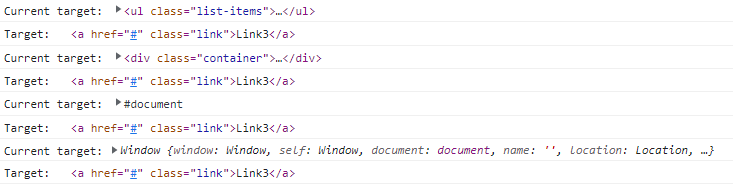

# Javascript Notes

- [Javascript Notes](#javascript-notes)
  - [Javascript Basics](#javascript-basics)
    - [Ways to add js](#ways-to-add-js)
    - [variable](#variable)
    - [functions](#functions)
    - [Objects](#objects)
    - [Array Methods](#array-methods)
    - [Value vs Reference](#value-vs-reference)
  - [DOM](#dom)
    - [window object](#window-object)
    - [Traverse child nodes](#traverse-child-nodes)
    - [Mouse Events](#mouse-events)
    - [Key Events](#key-events)
    - [Event Object](#event-object)
    - [Example of event bubbling](#example-of-event-bubbling)
    - [Forms events](#forms-events)
    - [Local Storage](#local-storage)
    - [setTimeout](#settimeout)
    - [setInterval](#setinterval)
    - [Global events](#global-events)
    - [Width and Height](#width-and-height)
    - [resize event](#resize-event)
  - [Objects](#objects-1)
    - [this keyword](#this-keyword)
    - [Factory Function](#factory-function)
    - [Constructor](#constructor)
    - [Prototypal Property](#prototypal-property)
    - [ES6 Classes](#es6-classes)
    - [Call, Apply and Bind](#call-apply-and-bind)
  - [Functions](#functions-1)
    - [IIFE](#iife)
    - [Hoisting](#hoisting)
    - [Closure](#closure)
  - [ES6](#es6)
    - [variable](#variable-1)
    - [Template Literals / String](#template-literals--string)
    - [Arrow functions / Fat Arrow functions](#arrow-functions--fat-arrow-functions)
    - [Basic this example](#basic-this-example)
    - [Destructuring](#destructuring)
    - [New String methods](#new-string-methods)
    - [for of](#for-of)
    - [for in](#for-in)
    - [Spread operator [...]](#spread-operator-)
    - [Rest Operator](#rest-operator)
    - [Array.from and Array.of](#arrayfrom-and-arrayof)
    - [find,findIndex,every,some](#findfindindexeverysome)
    - [Convert objects into arrays](#convert-objects-into-arrays)
    - [Set Object](#set-object)
    - [String includes](#string-includes)
    - [Array includes()](#array-includes)

## Javascript Basics

### Ways to add js

- **Inline**

```javascript
<button onclick="alert('Inline Js')">click me!</button>
```

- **Internal**

```javascript
<script>
document.querySelectorAll(".btn").forEach((element, index) => {
element.addEventListener("click", () => {
   alert("This is Button number "+index);
 });
});
</script>
```

- **External**

```htm
<script src="./main.js"></script>
```

### variable

1. Must start with letter ,$ or \_
2. No keyword
3. camelCase or underscore
4. case sensitive - fullName vs FullName

- **var**

1. var variables can be re-declared and updated

```javascript
var greeter = "Hello";
var greeter = "Hey";
```

```javascript
var greeting = "Hello";
greeting = "Hey";
```

- **let**

1. let is block scoped
2. A block is a chunk of code bounded by {}.
3. let can be updated but not re-declared.

```javascript
let greeting = "Hello";
greeting = "Hey";
```

```javascript
let greeting = "Hello";
let greeting = "Hey"; // error: Identifier 'greeting' has already been declared

// if the same variable is defined in different scopes, there will be no error
let greeting = "Hello";
if (true) {
  let greeting = "Hi";
  console.log(greeting); // "Hi"
}
console.log(greeting); // "Hello"
```

- **const**

1. const declarations are block scoped.
2. const cannot be updated or re-declared
3. we should always assign value while declaring const.

```javascript
const greeting = "Hello";
greeting = "Hey"; // error: Assignment to constant variable.
```

```javascript
const greeting = "Hello";
const greeting = "Hey"; // error: Assignment to constant variable.
```

```javascript
const greeting; // error: Missing initializer in constant declaration.
```

### functions

- **definition/declaration**

```javascript
function add(num1, num2) {
  return num1 + num2;
}
```

- **function expression**

```javascript
const addition = function add(num1, num2) {
  return num1 + num2;
};
```

```javascript
// anonymous function in javascript
const addition = function (num1, num2) {
  return num1 + num2;
};
//anonymous function as arrow function
const addition = (num1, num2) => {
  return num1 + num2;
};
```

### Objects

```javascript
const car = {
  make: "Dodge",
  model: "Challenger",
  year: 1970,
  colors: ["black", "red"],
  hybrid: false,
  drive: function () {
    console.log("driving...");
  },
  //ES6 syntax
  stop() {
    console.log("stopped!!!");
  },
};

console.log(car.make);
console.log(car.colors[0]);
car.drive();
car.stop();
```

### Array Methods

- **length**
- **unshift()** - instert items at index 0
- **shift()** - remove items from index 0
- **push()** - insert items at last index
- **pop()** - remove items from last index.
- **splice(startIndex , numberOfItems)** - give specific value from array but **mutates orignal array** avoid using it.

### Value vs Reference

- **Value**
  **Note** :- When assigning primitive data types(String,Number,Symbol,Boolean,Undefined,Null) to a variable any change are made directly to that value, without affecting original Value.

```javascript
let number = 1;
let number_2 = number;
console.log(`number: ${number} and number_2: ${number_2}`);
//number: 1 and number_2: 1
number_2 = 5;
console.log(`number: ${number} and number_2: ${number_2}`);
//number: 1 and number_2: 5
```

- **Reference**
  **Note** :- When assigning non-primitive data types(Arrays,Function,Objects) to a variable is done by reference so any change will affects all the reference

```javascript
let person = { name: "ashutosh" };
let person_2 = person;
console.log(`person name : ${person.name} and person_2 name: ${person_2.name}`);
//person name : ashutosh and person_2 name: ashutosh
person_2.name = "Ethan";
console.log(`person name : ${person.name} and person_2 name: ${person_2.name}`);
//person name : Ethan and person_2 name: Ethan

//ES6 Fix - we can use spread operator
let person_3 = { ...person }; // not pointing to person but we are copying.
person_3.name = "Ethan";
console.log(`person name : ${person.name} and person_3 name: ${person_3.name}`);
//person name : ashutosh and person_3 name: Ethan
```

## DOM

### window object

- **window object** :- also knowns as browser api.
- **document** - document is present inside window object alongside other object.

  - return node object or node list , which is an array like object
  - convert NodeList to array using
  - if you want to find out the methods and property present on node object use **console.dir(document)** , you can pass different node object.

```javascript
let res = document.querySelectorAll(".btn");
console.log(res);
console.log(typeof res);
//  nodeList.forEach() is now standard and supported in all current browsers
res.forEach((element) => {
  console.log(element);
});

// ES6 allow you to do it in two more ways
// let myArray = Array.from(NodeList);
//let myArray = [...NodeList] // deconstructing;
console.log([...res]);

Array.from(res).forEach((element) => {
  console.log(element);
});

let heading = document.getElementById("heading");
console.log(typeof heading);
console.log(heading);
console.log(heading.nodeName);
console.log(heading.style); // provide all css declaration property .
heading.style.backgroundColor = "red"; // set background as red for for heading.
```

- **document.getElementsByTagName("h1") and document.getElementsByClassName()**
  - return HTMLCollection array-like object , You can access by index and length property but we can't use array methods like forEach.

```javascript
let byTag = document.getElementsByTagName("h1");
console.log("tag", byTag);
// before using forEach convert it to Array using ES6 syntax
Array.from(byTag).forEach((element) => {
  console.log(element);
});
let arrayValue = [...byTag];
console.log("arrayvalue:", arrayValue);
arrayValue.forEach((element) => {
  console.log(element);
});
```

- **document.querySelectorAll(".btn")**
  - **document.querySelector(".btn")**- return first match single unit.( it's not a NodeList)
  - Most powerful and used mostly as we can use complex query selector .
  - return NodeList objects and we can directly run array methods.
  - You can turn them to array using spread operator [...] and Array.from()
  - but to iterate it's not required as latest browser supports direct forEach now.

### Traverse child nodes

- **childNodes and children**

```html
<ul class="fruits">
  <li>Apple</li>
  <li>Banana</li>
  <li>Orange</li>
  <li>Kiwi</li>
  <li>Mango</li>
</ul>
```

```javascript
const fruits = document.querySelector(".fruits");

const allChildNode = fruits.childNodes; // return (NodeList)all childNodes including whitespace which is treated as text node
console.log(allChildNode);
// NodeList(11) [text, li, text, li, text, li, text, li, text, li, text]
const allChildren = fruits.children; // return(HTMLCollection) and only children
console.log(allChildren);
//HTMLCollection(5) [li, li, li, li, li]
```

- **parent**

```html
<div id="main-heading">
  <h1>Main Heading</h1>
  <div class="sub-heading">
    <h2>Sub Heading</h2>
  </div>
</div>
```

```javascript
let subHeading = document.querySelector(".sub-heading");
console.log(subHeading);
subHeading.style.color = "green";
let parent = subHeading.parentElement;
console.log(parent);
parent.style.color = "red";
```

- **previousSibling and nextSibling**

  - return whitespace.
  - .nextSibling will return text node.
  - try to use .nextSibling.nextSibling to get the next sibling.
  - same goes for previousSibling.

- **previousElementSibling and nextElementSibling**

  - select next/ previous element sibling and exclude whitespace text node.
  - used most of the time.

- **nodeValue vs textContent**

```html
<div id="special">This is content value</div>
```

```javascript
let special = document.querySelector("#special");
console.log(special.childNodes);
console.log(special.childNodes[0].nodeValue);
// accessing directly nodeValue will return null so we must use
// childNodes[0] will be be text node
// we can use firstChild as well.
console.log(special.firstChild.nodeValue);
// textContent will directly return value.
console.log(special.textContent);
```

- **getAttribute() and setAttribute()**

```html
<div id="special">This is content value</div>
```

```javascript
const special = document.querySelector("#special");
console.log(special.getAttribute("id"));
special.setAttribute("class", "hello");
special.textContent = "this is updated content";
```

- **Add and remove class dynamically using classList vs style**
  - if we use style we need to write all properties one by one .
  - Best approach is write a css file with class name and add class using classList.

```html
<!DOCTYPE html>
<html lang="en">
  <head>
    <meta charset="UTF-8" />
    <meta http-equiv="X-UA-Compatible" content="IE=edge" />
    <meta name="viewport" content="width=device-width, initial-scale=1.0" />
    <title>Javascript Basics</title>
    <style>
      .changeColor {
        color: red;
      }
      .changeFontSize {
        font-size: 3rem;
      }
    </style>
  </head>
  <body>
    <h1 id="first">This is first element.</h1>
    <h1 id="second">This is second element.</h1>
    <h1 id="third">This is third element.</h1>
    <button id="btn">Click to toggle</button>
  </body>
  <script src="./main.js"></script>
</html>
```

```javascript
const first = document.querySelector("#first");
first.style.backgroundColor = "red";
first.style.color = "white";
first.style.fontSize = "3rem";
```

```javascript
const first = document.querySelector("#first");
const second = document.querySelector("#second");
const third = document.querySelector("#third");
const btn = document.querySelector("#btn");
first.className = "changeColor";
first.className = "changeFontSize"; // this will override the changeColor class
first.className = "changeColor changeFontSize"; // this will resolve the issue but not a best way to do things.

// classList
second.classList.add("changeColor");
second.classList.add("changeFontSize");
// This will not override changeColor class as it's adding in the list.
second.classList.remove("changeColor"); // This will only remove changeColor class

third.classList.add("changeFontSize");

btn.addEventListener("click", function (e) {
  console.log(e);
  console.log(this); // note if you use arrow function this will represent window and not button.
  third.classList.toggle("changeColor");
});

if (third.classList.contains("changeFontSize")) {
  console.log(`Third element contains changeFontSize class !!`);
} else {
  console.log(`Third element doesn't contain changeFontSize class`);
}
```

- **createElement/createTextNode/appendChild**
  - appendChild will always add the child in the end .

```html
<div class="container">
  <div class="main-heading">This is main heading</div>
</div>
```

```javascript
const container = document.querySelector(".container");
console.log(container.children); // HTMLCollection [div.main-heading]

// create div element with class sub-heading

let newDivElement = document.createElement("div");
// createTextNode
let textNode = document.createTextNode("This is sub heading");
// append text node to element
newDivElement.appendChild(textNode);
// now add sub-heading class to new element
newDivElement.classList.add("sub-heading");
// now append new element to container
container.appendChild(newDivElement);
console.log(container.children); // HTMLCollection(2) [div.main-heading, div.sub-heading]
```

- **insertBefore()**
  - insertBefore(element,location)

```javascript
const container = document.querySelector(".container");
const mainHeadingElement = document.querySelector(".main-heading");
console.log(container.children); // HTMLCollection [div.main-heading]
// create div element with class sub-heading
let newDivElement = document.createElement("div");
// createTextNode
let textNode = document.createTextNode("This is sub heading");
// append text node to element
newDivElement.appendChild(textNode);
// now add sub-heading class to new element
newDivElement.classList.add("sub-heading");
// now insert newDivElement before main heading
container.insertBefore(newDivElement, mainHeadingElement);
console.log(container.children); // HTMLCollection(2) [div.sub-heading, div.main-heading]
```

- **replaceChild()**
  - insertBefore(element,location)

```javascript
const container = document.querySelector(".container");
const mainHeadingElement = document.querySelector(".main-heading");
console.log(container.children); // HTMLCollection [div.main-heading]
// create div element with class sub-heading
let newContentElement = document.createElement("div");
// createTextNode
let newTextNode = document.createTextNode(
  "This content has replaced old  main heading"
);
newContentElement.classList.add("updated-main-heading");
// append text node to element
newContentElement.appendChild(newTextNode);
container.replaceChild(newContentElement, mainHeadingElement);
console.log(container.children); // HTMLCollection [div.updated-main-heading]
```

- **prepend and innerText**
  - allow us to set text right away instead of creating textnode and then appending to newly created element.

```javascript
const container = document.querySelector(".container");
console.log(container.children); // HTMLCollection [div.main-heading]
const mainHeadingElement = document.querySelector(".main-heading");

const dynamicElement = document.createElement("h2");
dynamicElement.innerText = `This is dynamic h2 heading`;
container.prepend(dynamicElement);
console.log(container.children); //HTMLCollection(2) [h2, div.main-heading]
```

- **innerHTML and textContent**
  - innerHTML:- return HTML structure. We don't need to **createTextNode** we can simply set the value under element using elementName.innerHTML=`<p>Hello</p>` , use template string as it's more flexible.
  - textContent:- return only text value. we can insert textContent using this as well ,elementName.textContent=`Hello`

### Mouse Events

- **click** - fires after full action occurs.
- **mousedown** - button is pressed.
- **mouseup** - button released.
- **mouseenter** - moved on to an element.
- **mouseleave** - moved out of an element.

### Key Events

- **keypress** - when key is pressed.
- **keydown** - when key is down. This will be fired if we hold on the key in pressed/down state.
- **keyup** - when key is release.

### Event Object

- argument (e,event) - info about triggered event.
- **event.type**
- **event.currentTarget** - always refers to the element to which event handler has been attached.
- **event.target** - identifies the element on which the event occurred. if there are nested element then only element which we have clicked will be impacted.
- **this** returns same as event.currentTarget but if we use arrow function this will not point to current element but instead it will point to window object.
- **preventDefault()** - prevents default behavior like for link it will not scroll to top.

```html
<!DOCTYPE html>
<html lang="en">
  <head>
    <meta charset="UTF-8" />
    <meta http-equiv="X-UA-Compatible" content="IE=edge" />
    <meta name="viewport" content="width=device-width, initial-scale=1.0" />
    <title>Javascript Basics</title>
    <style>
      .modified {
        color: red;
        font-size: 3rem;
      }
      a {
        display: inline-block;
        margin-top: 100vh;
      }
    </style>
  </head>
  <body>
    <div class="main-heading">Events in Javascript</div>
    <button id="btn">Click Me</button><br />
    <a href="#">Random Link</a>
  </body>
  <script src="./main.js"></script>
</html>
```

```javascript
const heading = document.querySelector(".main-heading");
const btn = document.querySelector("#btn");
const link = document.querySelector("a");
btn.addEventListener("click", function (e) {
  console.log(e);
  console.log(e.currentTarget);
  console.log(e.type);
  e.currentTarget.classList.toggle("modified");
});

heading.addEventListener("click", function (e) {
  console.log(e.currentTarget);
});

link.addEventListener("click", function (e) {
  console.log(e.preventDefault());
});
```

- **event propagation** - order the events are fired.
- **event bubbling** - clicked element first then bubble up-- **default behavior**.
- **event capturing** - fires at the root and fires until reaches target. **top to bottom.**
- **Allow us to select dynamic elements**

```html
<!DOCTYPE html>
<html lang="en">
  <head>
    <meta charset="UTF-8" />
    <meta http-equiv="X-UA-Compatible" content="IE=edge" />
    <meta name="viewport" content="width=device-width, initial-scale=1.0" />
    <title>Javascript Basics</title>
  </head>
  <body>
    <div class="container">
      <ul class="list-items">
        <li class="item"><a href="#" class="link">Link1</a></li>
        <li class="item"><a href="#" class="link">Link2</a></li>
        <li class="item"><a href="#" class="link">Link3</a></li>
      </ul>
    </div>
  </body>
  <script src="./main.js"></script>
</html>
```

```javascript
const container = document.querySelector(".container");
const list = document.querySelector(".list-items");

const showBubbling = function (e) {
  console.log("Current target:", e.currentTarget);
  console.log("Target:", e.target);
};

const stopPropagation = function (e) {
  console.log("Current target:", e.currentTarget);
  console.log("Target:", e.target);
  e.stopPropagation();
};

container.addEventListener("click", showBubbling);
list.addEventListener("click", showBubbling);
//list.addEventListener("click", stopPropagation);
document.addEventListener("click", showBubbling);
window.addEventListener("click", showBubbling);
```

**Output Event bubbling**


```javascript
const container = document.querySelector(".container");
const list = document.querySelector(".list-items");

const showBubbling = function (e) {
  console.log("Current target:", e.currentTarget);
  console.log("Target:", e.target);
};

const stopPropagation = function (e) {
  console.log("Current target:", e.currentTarget);
  console.log("Target:", e.target);
  e.stopPropagation();
};
container.addEventListener("click", showBubbling, { capture: true });
list.addEventListener("click", showBubbling, { capture: true });
document.addEventListener("click", showBubbling, { capture: true });
window.addEventListener("click", showBubbling, { capture: true });
```

**Output Event capturing**


### Example of event bubbling

- Imagine you are adding dynamic H1 tag so to add any event listener we can target parent container and add event listener there to perform action.

```javascript
const container = document.querySelector(".container");
const btn = document.querySelector(".btn");

btn.addEventListener("click", function (e) {
  const element = document.createElement("h1");
  element.classList.add("heading");
  element.textContent = ` I am dynamic H1 tag`;
  container.appendChild(element);
});

container.addEventListener("click", function (e) {
  if (e.target.classList.contains("heading")) {
    console.log("You have selected H1 tag by using event bubbling.");
  }
});
```

### Forms events

- submit event listener.
- prevent default
- how to get value

```html
<form action="" id="form">
  <input type="text" id="name" />
  <input type="password" id="password" />
  <input type="submit" value="submit" />
</form>
```

```javascript
const form = document.querySelector("#form");
const nameField = document.querySelector("#name");
const pwdField = document.querySelector("#password");

form.addEventListener("submit", function (e) {
  e.preventDefault(); // by default forms is submitted and page is refreshed , in that case we can't get value of field.
  console.dir(nameField);
  console.log(nameField.value);
  console.log(pwdField.value);
});
```

### Local Storage

- localStorage
- sessionStorage
- methods (setItem,getItem,removeItem,clear)
- use JSON.stringify() to set complex value like object and array.
- use JSON.parse() to get the value.

```javascript
localStorage.setItem("amount", "10");
const info = {
  name: "Ashutosh",
  age: 31,
};
localStorage.setItem("info", JSON.stringify(info));
const value = JSON.parse(localStorage.getItem("info"));
console.log(value);

const friends = ["Sharon", "Ethan"];
localStorage.setItem("friends", JSON.stringify(friends));
const friendValue = JSON.parse(localStorage.getItem("friends"));
console.log(friendValue);

let fruits;

if (localStorage.getItem("fruits")) {
  fruits = JSON.parse(localStorage.getItem("fruits"));
} else {
  fruits = [];
}
console.log(fruits);
fruits.push("apple");
localStorage.setItem("fruits", JSON.stringify(fruits));
```

### setTimeout

- runs code once after given time.
- time is mentioned in ms.

```javascript
const greet = function () {
  console.log("Hello");
};

setTimeout(greet, 2000);

setTimeout(function () {
  console.log("Helllloooo");
}, 3000);

const showScore = function (name, score) {
  console.log(`Hello ${name} , Your score is ${score}`);
};

const firstId = setTimeout(showScore, 3000, "ashutosh", "85");
const secondId = setTimeout(showScore, 3000, "Sharon", "100");
console.log(firstId);
console.log(secondId);
clearTimeout(firstId);
```

### setInterval

- runs code on specific interval repeatedly.

```javascript
const greet = function () {
  console.log("Hello");
};

setInterval(greet, 2000);

setInterval(function () {
  console.log("Helllloooo");
}, 3000);

const showScore = function (name, score) {
  console.log(`Hello ${name} , Your score is ${score}`);
};

const firstId = setInterval(showScore, 3000, "ashutosh", "85");
const secondId = setInterval(showScore, 3000, "Sharon", "100");
console.log(firstId);
console.log(secondId);
clearInterval(firstId);
```

### Global events

- **DOMContentLoaded** - only html is loaded it doesn't wait for css or assets.
- **load** - wait for entire page to load along with html,css and assets
- **scroll**

```javascript
window.addEventListener("DOMContentLoaded", function () {
  // code
});
// You can use document as well.
document.addEventListener("DOMContentLoaded", function () {
  // code
});
```

```javascript
window.addEventListener("load", function () {
  // code
});
// You can use document as well.
document.addEventListener("load", function () {
  // code
});
```

```javascript
window.addEventListener("scroll", function () {
  console.log(window.scrollX + "px");
  console.log(window.scrollY + "px");
});
```

### Width and Height

- **innerWidth** the read only window property the interior width of the window in pixels.
- **innerHeight** the read only window property the interior height of the window in pixels.
- **Element.getBoundingClientRect()** return DOMRect object providing info about size and it's position relative to the viewport.

### resize event

- fires when the document view (window) has been resized.

## Objects

- Object literal syntax {}
- dot notation vs bracket notation
- nested object
- set variable as property value

```javascript
const car = {
  make: "Bugatti",
  model: "Chiron",
  colors: ["Blue", "black"],
  hybrid: true,
  drive: () => {
    console.log("driving");
  },
  stop() {
    console.log("stopping");
  },
};

console.log(car.make);
console.log(car.colors[0]);
car.drive();
car.stop();
//change value
car.model = "veron";
// add new value;
car.releaseYear = 2022;
// delete
delete car.hybrid;
console.log(car);
```

```javascript
// Nested object Example
const age = 31;
const address = "Bangalore";
let dynamicVariable = "favorite food";
// You can reassign the variable and use it .. not used regularly but you can find use case in react application.
dynamicVariable = "job";
const person = {
  name: "ashutosh",
  // set variable as property value
  age: age,
  // es6 syntax if variable name is same as property name
  address,
  married: true,
  greet(name) {
    console.log(`Hello ${name}`);
  },
  job: {
    title: "AEM developer",
    company: {
      name: "wipro",
      address: "bangalore",
    },
  },
  "random-value": "random text value",
  "favorite food": "Biryani",
};

console.log(person.job.title);
console.log(person.job.company.name);
console.log(person);
console.log(person["random-value"]);
console.log(person[dynamicVariable]);
console.log(person["age"]);
console.log(person["job"]["title"]);
console.log(person["job"]["company"]["name"]);
```

### this keyword

- points to the left of the dot
- In regular function (not arrow) **this** determined by **how** a function is invoked (left of .)
- refers to parent , left of the dot.
- default to global - **window**

```javascript
// This example

const personalInfo = {
  firstName: "ashutosh",
  lastName: "shrivastava",
  fullName: function () {
    console.log(this);
    console.log(`My fullname is ${this.firstName} ${this.lastName}`);
  },
};
// left to the dot is personalInfo so this is pointing to personalInfo object
personalInfo.fullName();
personalInfo["firstName"] = "sharon";
personalInfo["lastName"] = "prittina";
personalInfo.fullName();
```

```javascript
function showThis() {
  console.log(this);
}
const ashutosh = {
  name: "Ashutosh Shrivastava",
  showThis: showThis,
};
// this inside showThis will point to ashutosh
ashutosh.showThis();
// this inside showThis will point to window
showThis();
const btn = document.querySelector(".btn");
// this inside showThis will point to btn
btn.addEventListener("click", showThis);
btn.addEventListener("click", function () {
  // this inside showThis will point to window
  showThis();
});
```

### Factory Function

```javascript
// Factory function

function createPerson(firstName, lastName) {
  return {
    firstName: firstName,
    lastName: lastName,
    fullName: function () {
      console.log(this);
      console.log(`My fullname is ${this.firstName} ${this.lastName}`);
    },
  };
}

const ashu = createPerson("ashutosh", "shrivastava");
ashu.fullName();

const ethan = createPerson("Ethan Shaurya", "Shrivastava");
ethan.fullName();
```

### Constructor

- Use Capital Case for Constructor (Standard but not mandatory)
- new - creates new object , points to it and omit return
- All objects in javascript have access to constructor property that returns a constructor function that created it.
- built in constructor functions.
- array and functions are objects in javascript.

```javascript
// Constructor
function Person(firstName, lastName) {
  this.firstName = firstName;
  this.lastName = lastName;
  this.fullName = function () {
    console.log(
      `My fullname is ${this.firstName} ${this.lastName} and i love JS`
    );
  };
  console.log(this);
}

const leo = new Person("Leo", "Messi");
console.log(leo.constructor);
// points to function Person

// Using leo constructor which actually points to Person to create xavi object , not typically used but good to know.
const xavi = new leo.constructor("xavi", "hernandez");
xavi.fullName();

const neymar = {};
console.log(neymar.constructor);
// ƒ Object() { [native code] }

const list = [];
console.log(list.constructor);
//ƒ Array() { [native code] }

const sayHi = function () {};
console.log(sayHi.constructor);
// ƒ Function() { [native code] }
```

### Prototypal Property

- Javascript uses prototypal inheritance model. That means that every constructor function/class has a prototype property that is shared by every instance of the constructor/class . So any properties and methods or prototype can be accessed by every instance. prototype property returns object.
- Property Lookup :- If child doesn't have ask parent.
- everything in JS is an Object.
  - **Note :-** Each prototype has prototype whose constructor is object (f Object())

```javascript
// Prototypal Property
function Account(name, initialBalance) {
  this.name = name;
  this.balance = initialBalance;
  this.bank = "HSBC";
  // instead of creating method as a part of instance define in prototype.
  // this.deposit = function (amount) {
  //   this.balance += amount;
  //   console.log(`Hello ${this.name}, your balance is ${this.balance}`);
  // };
}
Account.prototype.bank = "HDFC";
Account.prototype.deposit = function (amount) {
  this.balance += amount;
  console.log(`Hello ${this.name}, your balance is ${this.balance}`);
};
// when you create instance you don't copy methods but have access to them bcoz they are stored in prototype.
const robin = new Account("robin", 1000);
const zee = new Account("Zee", 0);
console.log(robin);
// this will return HSBC because instance of bank property but if property is not present in instance then it will look up in parent prototype.
console.log(robin.bank);
robin.deposit(500);
zee.deposit(5000);
//object :- in console you can see that you have prototype where all methods are stored.
console.log({});
//array :- in console you can see that you have prototype where all methods are stored.
console.log([]);
```

### ES6 Classes

- Syntactic Sugar
- Prototypal Inheritance
- Cleaner syntax
- Use first letter as Capital case.
- use this inside constructor.
- no need to add this for property inside class .
- methods will be in prototype and properties will be in each instance.
- Access to all properties which is setup inside constructor or inside class.

```javascript
class Account {
  constructor(name, initialBalance) {
    this.name = name;
    this.balance = initialBalance;
  }
  bank = "HSBC";
  deposit(amount) {
    this.balance += amount;
    console.log(`Hello ${this.name}, your balance is ${this.balance}`);
  }
}

const robin = new Account("robin", 1000);
console.log(robin);
console.log(robin.initialBalance);
robin.deposit(500);

const zee = new Account("zee", 0);
console.log(zee);
console.log(zee.bank);
zee.deposit(2000);
```

### Call, Apply and Bind

- **call** runs instantly , argument - list of items.
- **Apply** runs instantly , argument - array of items.
- **Bind** assign, use later , argument - list of items.

```javascript
// call
const ashu = {
  name: "ashutosh",
  age: 24,
  greet: function (city, country) {
    console.log(this);
    console.log(
      `Hi, I am ${this.name} and i am ${this.age} old and i live in ${city},${country}`
    );
  },
};

const sharon = {
  name: "sharon",
  age: 24,
};

function greet(city, country) {
  console.log(this);
  console.log(
    `Hello, I am ${this.name} and i am ${this.age} years old and i live in ${city},${country}`
  );
}

greet.call(ashu, "Bangalore", "India");
greet.call(sharon, "Bangalore", "India");
greet.call({ name: "ethan", age: 3 }, "Bangalore", "India");
// calling greet of ashu but passing sharon object
ashu.greet.call(sharon, "Bangalore", "India");
```

```javascript
//Apply example
const ashu = {
  name: "ashutosh",
  age: 24,
  greet: function (city, country) {
    console.log(this);
    console.log(
      `Hi, I am ${this.name} and i am ${this.age} old and i live in ${city},${country}`
    );
  },
};

const sharon = {
  name: "sharon",
  age: 24,
};

function greet(city, country) {
  console.log(this);
  console.log(
    `Hello, I am ${this.name} and i am ${this.age} years old and i live in ${city},${country}`
  );
}

greet.apply(ashu, ["Bangalore", "India"]);
greet.apply(sharon, ["Bangalore", "India"]);
greet.apply({ name: "ethan", age: 3 }, ["Bangalore", "India"]);
// calling greet of ashu but passing sharon object
ashu.greet.apply(sharon, ["Bangalore", "India"]);
```

```javascript
// Bind example
const ashu = {
  name: "ashutosh",
  age: 24,
  greet: function (city, country) {
    console.log(this);
    console.log(
      `Hi, I am ${this.name} and i am ${this.age} old and i live in ${city},${country}`
    );
  },
};

const sharon = {
  name: "sharon",
  age: 24,
};

function greet(city, country) {
  console.log(this);
  console.log(
    `Hello, I am ${this.name} and i am ${this.age} years old and i live in ${city},${country}`
  );
}

// assign and call it later

const sharonGreet = greet.bind(sharon, "Bangalore", "India");
sharonGreet();

const sharonGreetTwo = ashu.greet.bind(sharon, "Coimbatore", "India");
sharonGreetTwo();
```

```javascript
const counter = {
  count: 0,
  increment() {
    console.log(this);
    this.count++;
    console.log(this.count);
  },
};

const btn = document.querySelector(".increment");
// fail because this is pointing to btn
//btn.addEventListener("click", counter.increment);

// some edge cases -- if we remove addEventListener then we will not have reference to increment function.
//btn.addEventListener("click", counter.increment.bind(counter));

// Will always work.
const incrementValue = counter.increment.bind(counter);
btn.addEventListener("click", incrementValue);
btn.removeEventListener("click", incrementValue);
```

## Functions

### IIFE

- **IIFE** Immediately invoked function expression.
- this is older approach- new approach is modules
- simple approach to avoid global scope pollution.
- good way at protecting the scope of your function and the variables within it.
- global namespace , extra steps

```javascript
const num1 = 30;
const num2 = 20;

function add() {
  console.log(`Add value is ${num1 + num2}`);
}
add();

// IIFE

// Anonymous function 1 invoking directly by wrapping in () and adding () at the end.
(function (a, b) {
  const num3 = 30;
  const num4 = 20;
  console.log(`Add value is ${num3 + num4}`);
})();

// Anonymous function 2 with passing argument
(function (a, b) {
  console.log(`Add value is ${a + b}`);
})(40, 50);

// return result Anonymous function 3 with passing argument
const result = (function (a, b) {
  return a + b;
})(100, 50);

console.log(result);
```

### Hoisting

- function and var declarations are hoisted.
- safer to access only after initialized.

```javascript
display();
complexFunc(); // this will throw error as firstName and lastName can't be referenced here.
console.log(age); // undefined
//console.log(firstNname); // Cannot access 'firstNname' before initialization
//console.log(lastName); //Cannot access 'lastName' before initialization
const firstNname = "Ashutosh";
let lastName = "Shrivastava";
// This can be called even before declaration bcoz when class will run javascript will put this at the start of the file but will be undefined.
var age = 31;
console.log(age); // 31
console.log(firstNname); //Ashutosh
console.log(lastName); //Shrivastava

function display() {
  console.log(
    `This function can be called even before declaration bcoz when class will run javascript will put this at the start of the file before anything else`
  );
}
function complexFunc() {
  console.log(`Hello your name is ${firstNname} ${lastName}`);
}

complexFunc(); // This will work properly.
```

### Closure

- closure gives you an access to an outer function's scope from inner function
- make private variables with closure.

```javascript
function outer() {
  let privateVar = "XXXXXX";
  function inner() {
    console.log(`From Inner function and secret value is ${privateVar}`);
  }
  return inner;
}

//console.log(privateVar); // This will throw error as it's out of scope.
console.log(outer()); // This will return signature of inner function
console.log(outer()()); // This will execute inner function and will have access to privateVar.

const value = outer();
console.log(value); // This will return signature of inner function
console.log(value()); // This will execute inner function and will have access to privateVar.
```

**Basic example**

```javascript
function newAccount(name, initialBalance) {
  let balance = initialBalance;
  function showBalance() {
    console.log(`Hey ${name}, your balance is ${balance}`);
  }
  return showBalance;
}

newAccount("ashutosh", 500)();

const ethan = newAccount("Ethan", 1000);
const sharon = newAccount("Sharon", 1500);
ethan();
sharon();

// Note:- for each instance of newAccount is created showBalance remembers what was the value when newAccount was invoked.
```

**Complete example**

```javascript
function newAccount(name, initialBalance) {
  let balance = initialBalance;
  function showBalance() {
    console.log(`Hey ${name}, your balance is ${balance}`);
  }
  function deposit(amount) {
    balance += amount;
    showBalance();
  }
  function withdraw(amount) {
    if (amount > balance) {
      console.log(`Hey ${name}, Not enough funds`);
      return;
    } else {
      balance -= amount;
      showBalance();
    }
  }
  /*return method instead of function by
   converting it to object. */
  return { showBalance: showBalance, deposit: deposit, withdraw: withdraw };
}

const ethan = newAccount("Ethan", 1000);
const sharon = newAccount("Sharon", 1500);
ethan.showBalance();
ethan.deposit(500);
sharon.showBalance();
sharon.withdraw(1000);

/* Note:- for each instance of newAccount
 is created showBalance remembers 
 what was the value when newAccount was invoked. */
```

## ES6

### variable

1. Must start with letter ,$ or \_
2. No keyword
3. camelCase or underscore
4. case sensitive - fullName vs FullName

- **var**

1. var variables can be re-declared and updated
2. function scoped.

```javascript
// defining variable
var greeter = "Hello";
// re defining
var greeter = "Hey";
```

```javascript
var greeting = "Hello";
// updating variable
greeting = "Hey";
```

```javascript
var greeting = "Hello";
if (true) {
  var greeting = "Hi"; // if defined as var it will change the value outside block scoped as well.
  console.log(greeting); // "Hi"
}
console.log(greeting); // "Hi"
```

- **let**

1. let is block scoped
2. A block is a chunk of code bounded by {}.
3. let can be updated but not re-declared.

```javascript
let greeting = "Hello";
greeting = "Hey";
```

```javascript
let greeting = "Hello";
let greeting = "Hey"; // error: Identifier 'greeting' has already been declared

// if the same variable is defined in different scopes, there will be no error
let greeting = "Hello";
if (true) {
  let greeting = "Hi";
  console.log(greeting); // "Hi"
}
console.log(greeting); // "Hello"
```

- **const**

1. const declarations are block scoped.
2. const cannot be updated or re-declared
3. we should always assign value while declaring const.
4. Cannot mutate the primitive type but if it's object or array we can change the value.

```javascript
const greeting = "Hello";
greeting = "Hey"; // error: Assignment to constant variable.
```

```javascript
const greeting = "Hello";
const greeting = "Hey"; // error: Assignment to constant variable.
```

```javascript
const greeting; // error: Missing initializer in constant declaration.
```

```javascript
const person = {
  name: "ashutosh",
};
person.name = "ethan"; //  it's object or array we can change the value.
console.log(person.name);
```

```javascript
const greeting = "Hello";
if (true) {
  const greeting = "Hi there";
  console.log(greeting); // "Hi there"
}
console.log(greeting); // "Hello"
```

### Template Literals / String

- help to create string easily.
- powerful while inserting html dynamic .
- tagged template literals.
  - use spread operator ... args , it will copy all the variable so we don't have do define arg1,arg2 if there are multiple.
  - note text array will always have one more value than variable.

```javascript
const firstName = "Ashutosh";
const lastName = "Shrivastava";
const age = 31;

const phrase = `My full name is ${firstName} ${lastName} and I'm ${age} years old`;
const phrase2 = `My full name is ${firstName.toUpperCase()} ${lastName.toUpperCase()} and I'm ${age} years old`;

console.log(phrase); // My full name is Ashutosh Shrivastava and I'm 31 years old
```

```javascript
const person = {
  name: "ashutosh",
  job: "devloper",
  hobbies: ["cooking", "football"],
};

const result = document.getElementById("result");

result.innerHTML = `<h2>${person.name}</h2>
<p>${person.job}</p>
<ul>
${person.hobbies
  .map((item) => {
    return `<li>${item}</li>`;
  })
  .join("")}
</ul>
`;
```

```javascript
const firstName = "Ashutosh";
const lastName = "Shrivastava";
const age = 31;

const phrase = highlight`My full name is ${firstName} ${lastName} and I am ${age} years old.`;
const result = document.getElementById("result");

result.innerHTML = `${phrase}`;

// use spread operator ... args , it will copy all the variables so we don't have do define arg1,arg2 if there are multiple.
function highlight(text, ...args) {
  console.log({ text, args });
  const result = text.map((item, index) => {
    return `${item} <strong class='taggedClass'>${args[index] || ""}</strong>`;
  });
  return result;
}
```

### Arrow functions / Fat Arrow functions

- No name , always expression , assign to variable.
- no function keyword.
- **this** :- refers to it's **current surrounding scope**.
- In regular function (not arrow) **this** determined by **how** a function is invoked (left of .) , refers to **parent** , **left of the dot**.
- Use arrow function when necessarily ntt all the time.

```javascript
// if one line then no need of {} or return
const sayHello = () => console.log("Hello");
sayHello();

// if one param we can remove ()
// one line code will have implicit return so it will always return even without writing return.
const double = (value) => value * 2;
const res = double(5);
console.log(res);

// Two params and more than one line

const multiply = (num1, num2) => {
  const res = num1 * num2;
  // more code;
  return res;
};
console.log(multiply(5, 6));

// return object without return keyword then you can wrap in ()
const obj = () => ({ name: "Ashutosh", age: "31" });
console.log(obj());

// return object with return keyword
const obj2 = () => {
  return { name: "Sharon", age: "31" };
};

const person = obj2();
console.log(person);

// Call back function with anonymous arrow functions.
// filter method.
// add eventlistener

const number = [1, 2, 3, 4, 5, 6, 7, 8, 9, 10];

const big = number.filter((number) => number > 5);
console.log(big);
const small = number.filter((number, index) => {
  console.log(index);
  return number < 5;
});
console.log(small);

const btnElement = document.querySelector(".btn");

btnElement.addEventListener("click", (e) => {
  console.log(e.target);
});
```

### Basic this example

```javascript
const ashu = {
  name: "Ashutosh",
  age: 24,
  greet: function () {
    const self = this;
    setTimeout(function () {
      /* this will refer to window as in call back function 
      after 2 sec this refers to window (parent) . */
      /* 
      We can solve this 
      by using self
       */
      console.log(this);
      console.log(`Hello from ${self.name}`);
    }, 2000);
  },
};

const ethan = {
  name: "Ethan",
  age: 3,
  greet: function () {
    const self = this;
    setTimeout(() => {
      // current surrounding scope is ethan for this.
      console.log(this);
      console.log(`Hola from ${this.name}`);
    }, 2000);
  },
};

const sharon = {
  name: "Sharon",
  age: 24,
  greet: () => {
    console.log(this);
    console.log(`Hello from ${this.name}`);
  },
};

ashu.greet();
sharon.greet();
ethan.greet();
```

### Destructuring

- Faster/Easier ways to access/unpack values from arrays and objects in to variables.
- swap variables easily.
- **Array Example**
  - return undefined if it's out of index.

```javascript
const fruits = ["orange", "banana", "lemon"];
const friends = ["nitish", "abhishek", "nilay"];

// destructuring
const [f1, f2, f3, f4] = friends;
// return undefined if it's out of index.
console.log(f1, f2, f3, f4); // nitish abhishek nilay undefined

// for skipping value just add ","
const [fr1, , fr2] = friends;
console.log(fr1, fr2);

/* Swap value */

let first = "ashutosh";
let second = "Sharon";

console.log(first, second);
// swapping value using destructuring .
[second, first] = [first, second];
console.log(first, second);
```

- **Object Example**
  - Unlike arrays name has to match.
  - if properties is not there then undefined will return .
  - if you want the change the name use alias 'property :alias'

```javascript
/* Object Destructuring */

const ashutosh = {
  fname: "ashutosh",
  age: 31,
  city: "Bangalore",
  siblings: {
    sister: ["A", "B", "C"],
    brother: ["D", "E", "F"],
  },
  parents: {
    father: "Sachida",
    mother: "Usha",
  },
  JobDetails: ["Accenture", "Sapient", "Wipro"],
};

const {
  fname: first,
  age,
  city,
  zip,
  siblings: {
    sister: [a, b],
    brother: favBro,
  },
  parents: { father: FATHER, mother: MOTHER },
  JobDetails: [firstCompany, SecondCompany],
} = ashutosh;

console.log(
  first,
  age,
  city,
  zip,
  favBro,
  FATHER,
  MOTHER,
  firstCompany,
  SecondCompany,
  a,
  b
);
```

- **Object Example with function parameters**

```javascript
const ashutosh = {
  fname: "ashutosh",
  age: 31,
  city: "Bangalore",
  siblings: {
    sister: ["A", "B", "C"],
    brother: ["D", "E", "F"],
  },
  parents: {
    father: "Sachida",
    mother: "Usha",
  },
  JobDetails: ["Accenture", "Sapient", "Wipro"],
};

function printPerson({
  fname: first,
  age,
  city,
  zip,
  siblings: {
    sister: [a, b],
    brother: favBro,
  },
  parents: { father: FATHER, mother: MOTHER },
  JobDetails: [firstCompany, SecondCompany],
}) {
  console.log(
    "Values are",
    first,
    age,
    city,
    zip,
    favBro,
    FATHER,
    MOTHER,
    firstCompany,
    SecondCompany,
    a,
    b
  );
}

printPerson(ashutosh);
```

### New String methods

- startsWith()
- endsWith()
- includes()
- repeat()

```javascript
const person = "Ashutosh Shrivastava";
const employee = "20052220-EMP-ASHUTOSH-SHRIVASTAVA";
const manager = "20062220-MAN-SHARON-SHRIVASTAVA";

// startsWith
console.log(person.startsWith("Ash"));
console.log(employee.startsWith("EMP", 9));

//endsWith
console.log(manager.endsWith("SHRIVASTAVA"));
console.log(manager.endsWith("MAN", 12));

//includes
console.log(employee.includes("EMP"));

//repeat

const rep = (person, amount = 2) => {
  return person.repeat(amount);
};

const res = rep(person, 3);
console.log(res);
```

### for of

- loops through the values of an iterable object.
- String, Array,Map,Set etc---- **Not Object**
- unlike for each we can use break , continue.

```javascript
const fruits = ["Apple", "Banana", "orange", "kiwi"];
const longName = "Ashutosh Shrivastava aka ASHU";
let shortName = "";

for (const iterator of longName) {
  // console.log(iterator);
  if (iterator === " ") {
    continue;
  } else {
    shortName += iterator;
  }
}
console.log(shortName);

for (const iterator of fruits) {
  if (iterator === "orange") {
    break;
  }
  console.log(iterator);
}
```

### for in

- loop - iterate over objects properties.
- not advised to use it on arrays, especially if the order is important.
- on arrays use 'for of' instead.

```javascript
const person = { fname: "ashutosh", lname: "shrivatsava", job: "developer" };

// for (const iterator of person) {
//   console.log(iterator);
// }

for (const key in person) {
  if (Object.hasOwnProperty.call(person, key)) {
    const element = person[key];
    console.log(element);
  }
}

const fruits = ["Apple", "Banana", "orange", "kiwi"];

for (const index in fruits) {
  console.log(`Index- ${index}: Value - ${fruits[index]}`);
}
// It's easy to use for of.
for (const iterator of fruits) {
  console.log(iterator);
}
```

### Spread operator [...]

- Allows an iterable to spread/expend individually inside receiver.
- split into single items and **copy them**;
- Doesn't mutate original item.
- **Array example**

```javascript
const nameVal = "ASHUTOSH SHRIVASTAVA";

const letters = [...nameVal];
console.log(letters);

const boys = ["Ashu", "Diwakar", "Ethan", "Karthik", "Sachida"];
const girls = ["Sharon", "Khushboo", "Usha"];
const random = "random";

const res1 = [...boys, ...girls, random];
console.log(res1);
const res2 = [...boys, random, ...girls];
console.log(res2);

// don't assign as it reference same and it's mutate the array.
//const newArray = res2;
// instead copy them and make modification
const newArray = [...res2];
newArray[0] = "XYZ"; // it will affect res2 as well.

console.log(newArray);
console.log(res2);
```

- **Object Example** - ES8 - 2018.

```javascript
const person = {
  name: "Ashutosh",
  job: "developer",
};

/* If property is not there it will be added , if property is there it will be overridden
 */
const newPerson1 = { ...person };

const newPerson2 = { ...person, city: "Bangalore", name: "Ethan" };
console.log(newPerson1);
console.log(newPerson2);
console.log(person);
```

- **DOM Element Example**

```html
<body>
  <h1>Item1</h1>
  <h1>Item2</h1>
  <h1>Item3</h1>
  <h1>Item4</h1>
  <h1>Item5</h1>
  <h2 id="result"></h2>
</body>
```

```javascript
const h1Elements = document.querySelectorAll("h1");
const res = document.querySelector("#result");
const arrayValue = [...h1Elements];
console.log(arrayValue);
const resultText = arrayValue
  .map((item) => {
    return `<span>${item.textContent}</span>`;
  })
  .join("");
res.innerHTML = resultText;
```

- **Function Arguments**
  - Spread - When we are passing as an arguments.

```javascript
const number = [10, 20, 40, 50, 60];

console.log(Math.max(...number));

const person = ["Ashutosh", "Shrivastava"];

const greet = (fname, lname) => {
  console.log(`Hello ${fname} ${lname}`);
};

greet(...person);
```

### Rest Operator

- gathers/collects the items.
- A rest element must be last in a destructuring pattern.
- **Array**

```javascript
// Arrays
const fruits = ["Apple", "Orange", "Kiwi", "banana", "pear"];
const [first, ...restFruits] = fruits;
console.log(first, restFruits);
```

- **Object**

```javascript
// objects

const person = { fname: "ashutosh", lname: "shrivatsava", job: "developer" };

const { job, ...restPerson } = person;
console.log(job, restPerson);
```

- **functions** - Collecting **parameters** while passing to the function.

```javascript
const testScores = [80, 90, 75, 100, 85];

const getAvg = (name, ...scores) => {
  //   const total = scores.reduce((acc, curr) => {
  //     return (acc += curr);
  //   }, 0);
  let total = 0;
  //   scores.forEach((item) => {
  //     total += item;
  //   });

  for (const iterator of scores) {
    total += iterator;
  }
  console.log(total);
  console.log(`Hi ${name}, Your average score is ${total / scores.length}`);
};

getAvg(person.fname, 100, 200, 300, 400, 500);

getAvg("Sharon", ...testScores); // Using spred operator as argument
```

### Array.from and Array.of

- Not on the Prototype.
- Array.of - create new Array instance from variable number of arguments
- Array from - returns Array object from any object with a ling property or an iterable object.
- Array from - turn array-like/ish in to array -string ,nodeList,Set
- You can call **map function** as callback in Array.from

```javascript
const testArray = Array.of("Ashu", 31, true);
console.log(testArray);
```

```javascript
const nameVal = "Ashutosh";
console.log(Array.from(nameVal));

function countTotal() {
  //arguments is a keyword.
  //console.log(arguments);
  let arrayVal = Array.from(arguments);
  console.log(arrayVal);
  let total = 0;
  for (const iterator of arrayVal) {
    total += iterator;
  }
  console.log(total);
}

countTotal(10, 20, 30, 40, 50);
```

```javascript
const h1Elements = document.querySelectorAll("h1");
const res = document.querySelector("#result");
const second = document.querySelector("#second");
const arrayValue = Array.from(h1Elements);
console.log(arrayValue);
//longer approach
const resultText = arrayValue
  .map((item) => {
    return `<span>${item.textContent}</span>`;
  })
  .join("");
res.innerHTML = resultText;
//shorter approach
const secondTextVal = Array.from(document.querySelectorAll("h1"), (item) => {
  //console.log(item);
  return `<span>${item.textContent}</span>`;
}).join("");

console.log(secondTextVal);
second.innerHTML = secondTextVal;
```

### find,findIndex,every,some

- find - get specific item.
- findIndex- get's index of the item.
- every - return true/false if all the items in array matched the condition.
- some- return true/false if atleast one items in array matched the condition.

```javascript
const people = [
  { id: 1, name: "ashutosh" },
  { id: 2, name: "sharon" },
  { id: 3, name: "ethan" },
  { id: 4, name: "samual" },
];

// filter return an array object.
const testFilter = people.filter((item) => item.name.startsWith("s"));

console.log(testFilter); // two items return sharon and samual.

// return single item which is matched first .
const testFind = people.find((item) => item.name.startsWith("s"));
console.log(testFind); // sharon object return.

const testFindIndex = people.findIndex((item) => item.id === 3);
console.log(testFindIndex);

const newPeople = people.slice(0, testFindIndex);
console.log(newPeople);
```

```javascript
const grades = ["A", "B", "A", "B", "C"];
const goodGrades = ["A", "B", "A", "B"];

const testEvery = grades.every((item) => item !== "C");
console.log(testEvery);

const testSome = goodGrades.some((item) => item === "A");
console.log(testSome);
```

### Convert objects into arrays

**Object.keys()** - converts property names in to array.
**Object.values()** - converts property values in to array.
**Object.entries()** - converts property names and property values in to array

```javascript
const person = { fname: "ashutosh", lname: "shrivatsava", job: "developer" };

const keysArray = Object.keys(person);
console.log(keysArray);
```

```javascript
const person = { fname: "ashutosh", lname: "shrivatsava", job: "developer" };
const valuesArray = Object.values(person);
console.log(valuesArray);
```

```javascript
const person = { fname: "ashutosh", lname: "shrivatsava", job: "developer" };
const entriesArray = Object.entries(person);
console.log(entriesArray);

// map method.
const mapRes = entriesArray.map((item) => {
  const [first, second] = item;
  //return first; // return keys in array.
  return second; // return values in array.
});

console.log(mapRes);

// nested for of.

for (const item of entriesArray) {
  for (const iterator of item) {
    console.log(iterator);
  }
}

// using destructing --  for of.
for (const [first, second] of entriesArray) {
  console.log(first, second);
}
```

### Set Object

- stores a collection of unique values of anytype.

```javascript
const unique = new Set();

// add(values)

let random = "third";
unique.add("first");
unique.add("second");
unique.add(random);
unique.add("fourth");
console.log(unique);
// create array using Array from , we can use spread operator as well..
console.log(Array.from(unique));
console.log([...unique]);
// delete
const res = unique.delete(random);
console.log(res); // true
console.log(unique);

const isValue = unique.has("fourth");
console.log(isValue); // true

//Iterator

//entries()

console.log(unique.entries());
console.log(unique.keys());
console.log(unique.values());
unique.forEach((element) => {
  console.log(element);
});

// clear()
const res2 = unique.clear();
console.log(res2);
```

- **set usecase**

```javascript
const menu = [
  {
    id: 1,
    title: "buttermilk pancakes",
    category: "breakfast",
  },
  {
    id: 2,
    title: "diner double",
    category: "lunch",
  },
  {
    id: 3,
    title: "godzilla milkshake",
    category: "shakes",
  },
  {
    id: 4,
    title: "country delight",
    category: "breakfast",
  },
  {
    id: 5,
    title: "egg attack",
    category: "lunch",
  },
  {
    id: 6,
    title: "oreo dream",
    category: "shakes",
  },
  {
    id: 7,
    title: "bacon overflow",
    category: "breakfast",
  },
  {
    id: 8,
    title: "american classic",
    category: "lunch",
  },
  {
    id: 9,
    title: "quarantine buddy",
    category: "shakes",
  },
  {
    id: 10,
    title: "pan-seared steak",
    category: "dinner",
  },
];

// const categories = menu.map((item) => item.category);
// console.log(categories);

// const uniqueCategories = new Set(categories);
// console.log(uniqueCategories);

// const finalCategories = ["all", ...uniqueCategories];
// console.log(finalCategories);

const res = ["all", ...new Set(menu.map((item) => item.category))];
console.log(res); // ['all', 'breakfast', 'lunch', 'shakes', 'dinner']
```

### String includes

- case sensitive.

```javascript
const fName = "Ashutosh";
const res1 = fName.includes("A");
const res2 = fName.includes("A", 1); // staring postion to check.
console.log(res1); //true
console.log(res2); //false

const product = [
  { title: "Modern Poster" },
  { title: "Bar Stool" },
  { title: "Armchair" },
  { title: "Leather Chair" },
];

const searchTerm = "a";

const result = product.filter((product) =>
  product.title.toLowerCase().includes(searchTerm)
);
console.log(result);
```

### Array includes()

- checks if the items is in array.
- useful in the conditional statment.

```javascript
const groceries = ["lemon", "eggs", "orange", "milk"];

let searchText = "lemon";

const res1 = groceries.includes(searchText);
console.log(res1); // true

const res2 = groceries.includes(searchText, 1);
console.log(res2); // false

if (groceries.includes(searchText)) {
  console.log(`Yes the search item ${searchText} is present in an array`);
} else {
  console.log(`No the search item ${searchText} is not present in an array`);
}
```
